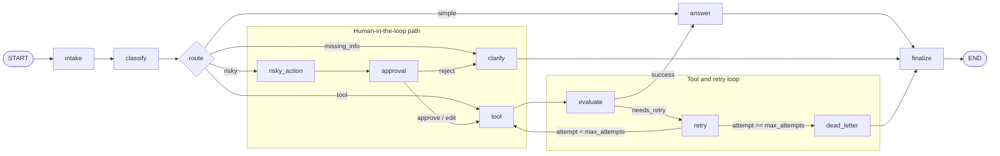

# Day 23 / Day 08 - LangGraph Agentic Orchestration Lab

This repository contains a completed LangGraph support-ticket agent for the Phase 2 Track 3 Day 8 lab. The workflow demonstrates typed state, conditional routing, retry loops, human-in-the-loop approval, persistence hooks, metrics generation, report rendering, and optional LangSmith tracing.

## What Is Implemented

The graph handles four workflow routes. Runtime tool errors are handled after routing:

| Route | Purpose |
|---|---|
| `simple` | Answer general support questions directly |
| `tool` | Run a mock lookup tool, evaluate result, then answer |
| `missing_info` | Ask a clarification question instead of hallucinating |
| `risky` | Prepare a side-effecting action, require approval, then run tool |

Core requirements covered:

- `classify_node` uses an LLM with structured output.
- `answer_node` uses an LLM grounded in query, tool results, and approval context.
- Risky actions go through `risky_action -> approval -> tool`; tool is never called before approval.
- Tool failures are runtime outcomes, not classifier routes; they are evaluated and retried with `attempt` and `max_attempts`.
- Retry exhaustion goes to `dead_letter`.
- Nodes append `nodes_visited`, `events`, and `audit_events`.
- Errors are typed error dictionaries.
- CLI generates `outputs/metrics.json` and `reports/lab_report.md`.
- LangSmith tracing is optional and additive, not a replacement for local metrics.

## Architecture

Target flow:

```text
START
  -> intake
  -> classify
  -> route

route == simple
  -> answer
  -> finalize
  -> END

route == tool
  -> tool
  -> evaluate
      -> success     -> answer -> finalize -> END
      -> needs_retry -> retry

route == tool with retry
  -> tool
  -> evaluate
      -> needs_retry
          -> retry
              -> attempt < max_attempts  -> tool -> evaluate -> ...
              -> attempt >= max_attempts -> dead_letter -> finalize -> END
      -> success
          -> answer -> finalize -> END

route == missing_info
  -> clarify
  -> finalize
  -> END

route == risky
  -> risky_action
  -> approval
      -> approve/edit -> tool -> evaluate
                            -> success     -> answer -> finalize -> END
                            -> needs_retry -> retry -> tool/dead_letter
      -> reject       -> clarify -> finalize -> END

runtime tool error
  occurs inside tool execution, then:
    tool -> evaluate
      -> needs_retry -> retry
          -> attempt < max_attempts  -> tool -> evaluate -> ...
          -> attempt >= max_attempts -> dead_letter -> finalize -> END
      -> success     -> answer -> finalize -> END

all terminal paths
  -> finalize
  -> END
```

Mermaid architecture diagram:



Important files:

| File | Purpose |
|---|---|
| `src/langgraph_agent_lab/state.py` | Typed state, audit event, approval, typed error schemas |
| `src/langgraph_agent_lab/nodes.py` | Node implementations and LangSmith trace decorators |
| `src/langgraph_agent_lab/routing.py` | Conditional routing functions |
| `src/langgraph_agent_lab/graph.py` | LangGraph `StateGraph` wiring |
| `src/langgraph_agent_lab/llm.py` | OpenAI-first LLM factory |
| `src/langgraph_agent_lab/observability.py` | `.env` loading and LangSmith compatibility helpers |
| `src/langgraph_agent_lab/metrics.py` | Metrics schema and aggregation |
| `src/langgraph_agent_lab/report.py` | Markdown report rendering |
| `data/sample/scenarios.jsonl` | Sample evaluation scenarios |
| `configs/lab.yaml` | Scenario runner config |

## Environment Setup

This submission is OpenAI-first. Use Python 3.11+ and the shared `venvAIA` environment.

```powershell
cd D:\AIA\Day23-2A202600666-HoangAnhThu-main
D:\AIA\venvAIA\Scripts\Activate.ps1
```

If PowerShell blocks activation:

```powershell
Set-ExecutionPolicy -Scope Process -ExecutionPolicy Bypass
D:\AIA\venvAIA\Scripts\Activate.ps1
```

Install dependencies:

```powershell
python -m pip install --upgrade pip
python -m pip install -e ".[dev,openai,sqlite]"
```

## Configure `.env`

Create your local `.env` from the template:

```powershell
Copy-Item .env.example .env
notepad .env
```

Minimum OpenAI configuration:

```env
OPENAI_API_KEY=your_openai_key_here
LLM_MODEL=gpt-4o-mini
```

Optional LangSmith tracing:

```env
LANGSMITH_TRACING=true
LANGSMITH_API_KEY=your_langsmith_key_here
LANGSMITH_PROJECT=phase2-track3-day8-langgraph-lab
```

Backward-compatible LangChain names are also supported:

```env
LANGCHAIN_TRACING_V2=true
LANGCHAIN_API_KEY=your_langsmith_key_here
LANGCHAIN_PROJECT=phase2-track3-day8-langgraph-lab
```

Secrets are ignored by git because `.env` is listed in `.gitignore`.

## Run Tests

```powershell
python -m pytest
```

Optional source lint:

```powershell
python -m ruff check src
```

Note: some graph smoke tests may be skipped if pytest does not see API keys as exported OS environment variables. The CLI runner loads `.env` itself.

## Generate Metrics And Report

Run all sample scenarios:

```powershell
python -m langgraph_agent_lab.cli run-scenarios --config configs/lab.yaml --output outputs\metrics.json
```

This updates:

```text
outputs/metrics.json
reports/lab_report.md
```

Validate metrics:

```powershell
python -m langgraph_agent_lab.cli validate-metrics --metrics outputs\metrics.json
```

Expected successful output:

```text
Metrics valid. success_rate=100.00%
```

## Grading Questions

The file `grading_questions.json` was also executed through the current graph and the results are saved in:

```text
outputs/grading_questions_results.json
reports/grading_questions_report.md
```

Current grading-question summary:

| Metric | Value |
|---|---:|
| Total questions | 10 |
| Phrase success rate | 30% |
| Top-1 document success rate | 0% |
| Overall success rate | 0% |

Important note: these grading questions include `expect_top1_doc_id` checks, but this LangGraph lab does not include a retrieval corpus with those document IDs. Because of that, top-1 document checks are reported as unavailable/failing in `reports/grading_questions_report.md` instead of being inferred.

## Make Commands

The Makefile is available for Unix-like shells:

| Command | Equivalent PowerShell command |
|---|---|
| `make test` | `python -m pytest` |
| `make lint` | `python -m ruff check src tests` |
| `make run-scenarios` | `python -m langgraph_agent_lab.cli run-scenarios --config configs/lab.yaml --output outputs\metrics.json` |
| `make grade-local` | `python -m langgraph_agent_lab.cli validate-metrics --metrics outputs\metrics.json` |

On Windows, direct Python commands are usually more reliable than `make`.

## LangSmith Tracing

Tracing is optional. It is enabled only when tracing is requested and a usable LangSmith key is configured. This avoids local failures when `LANGSMITH_TRACING=true` is present but the API key is blank.

The scenario runner passes this config to `graph.invoke`:

```python
config = {
    "configurable": {"thread_id": scenario_id},
    "tags": ["day8", "langgraph", "lab"],
    "metadata": {
        "scenario_id": scenario_id,
        "lab": "phase2-track3-day8",
    },
}
```

Traced nodes:

| Node | LangSmith run type |
|---|---|
| `classify_node` | `chain` |
| `tool_node` | `tool` |
| `evaluate_node` | `chain` |
| `answer_node` | `chain` |
| `approval_node` | `chain` |
| `retry_or_fallback_node` | `chain` |

Recommended screenshot location for LangSmith report evidence:

```text
reports/langsmith_trace/
```

Current screenshot files:

| File | Suggested evidence |
|---|---|
| `reports/langsmith_trace/trace_general.png` | LangSmith project trace list / overview |
| `reports/langsmith_trace/q1.png` | Scenario or trace detail screenshot 1 |
| `reports/langsmith_trace/q2.png` | Scenario or trace detail screenshot 2 |
| `reports/langsmith_trace/q3.png` | Scenario or trace detail screenshot 3 |
| `reports/langsmith_trace/q4.png` | Scenario or trace detail screenshot 4 |
| `reports/langsmith_trace/q5.png` | Scenario or trace detail screenshot 5 |
| `reports/langsmith_trace/q6.png` | Scenario or trace detail screenshot 6 |
| `reports/langsmith_trace/q7.png` | Scenario or trace detail screenshot 7 |

Because `lab_report.md` is inside `reports/`, reference those images with relative paths like this:

```md


```

## Scenario Coverage

The sample scenario file includes seven cases:

| Scenario | Expected route | What it checks |
|---|---|---|
| `S01_simple` | `simple` | Direct LLM answer |
| `S02_tool` | `tool` | Tool lookup and answer |
| `S03_missing` | `missing_info` | Clarification flow |
| `S04_risky` | `risky` | Refund/email approval flow |
| `S05_error` | `tool` | Tool route with transient runtime failure and retry |
| `S06_delete` | `risky` | Destructive action approval flow |
| `S07_dead_letter` | `tool` | Tool route with max retry exhaustion and dead letter |

## Submission Checklist

- [x] `classify_node` uses LLM structured output.
- [x] `answer_node` uses grounded LLM response generation.
- [x] Routes cover `simple`, `tool`, `missing_info`, and `risky`; runtime tool errors are handled by `evaluate -> retry`.
- [x] Retry loop uses `attempt` and `max_attempts`.
- [x] Failed tool results route through `evaluate -> retry`.
- [x] Max retry exhaustion routes to `dead_letter`.
- [x] Risky action requires approval before tool execution.
- [x] Approval supports approve, reject, and edit decisions.
- [x] Nodes append `nodes_visited` and `audit_events`.
- [x] Errors are typed error objects.
- [x] `metrics.json` includes success rate, retry, latency, interrupt, and approval metrics.
- [x] `lab_report.md` includes architecture, state schema, test cases, metrics, failure analysis, LangSmith tracing, and improvement plan.

## Notes For Demo

A useful demo route is `S05_error`: it classifies as `tool`, then the tool simulates a transient runtime failure, `evaluate` returns `needs_retry`, the graph retries, and eventually answers after success.

A useful HITL demo route is `S06_delete`: it classifies as `risky`, prepares a proposed action, records approval, then proceeds to the tool and answer path.
