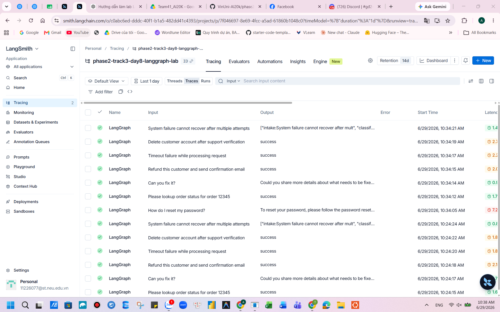
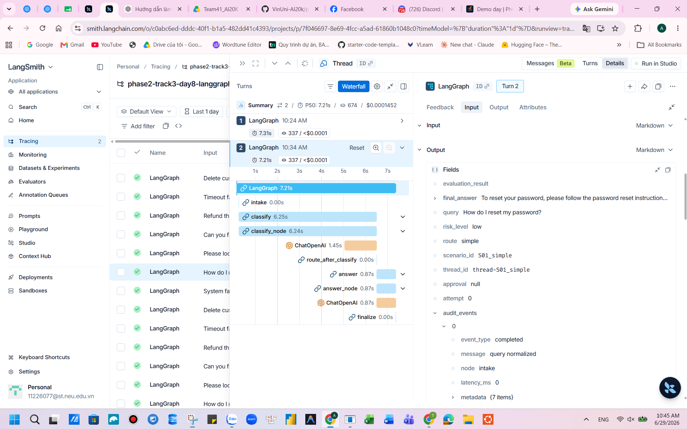
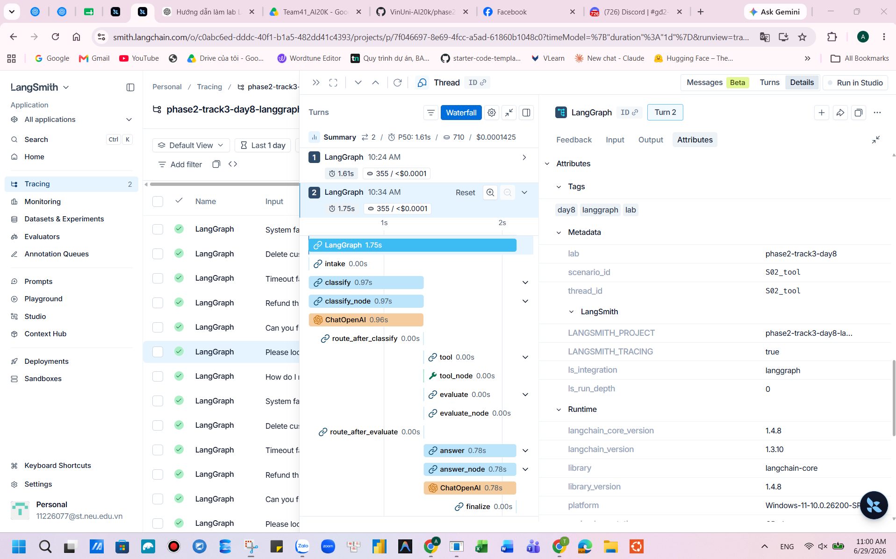
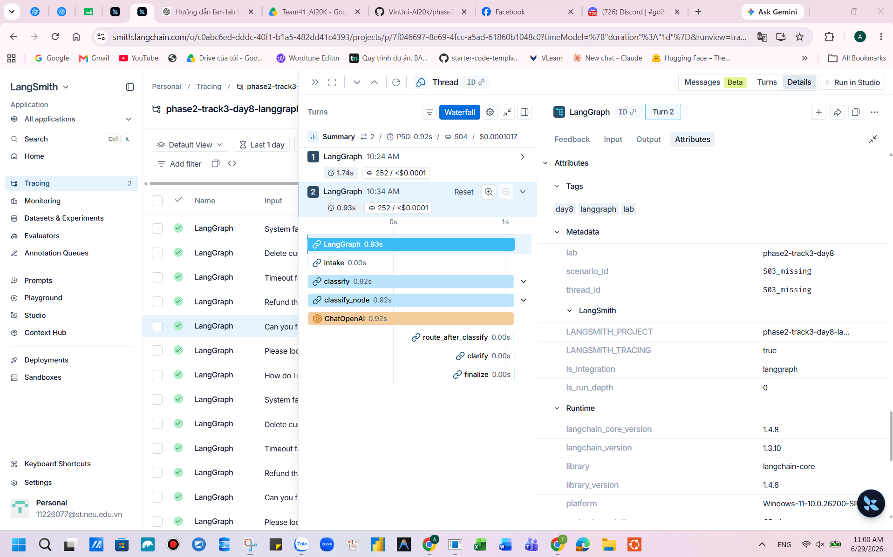
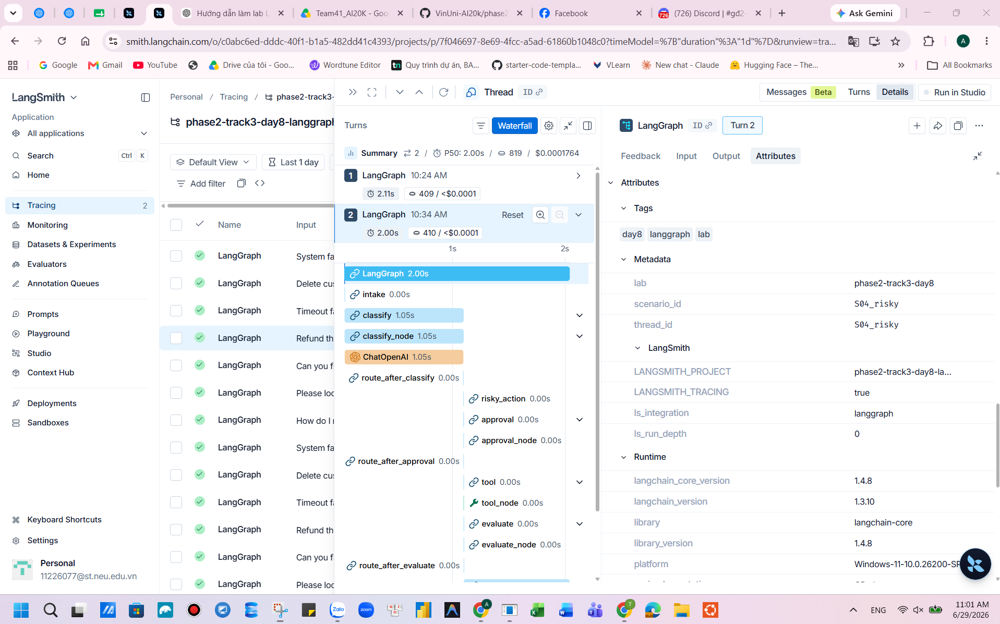
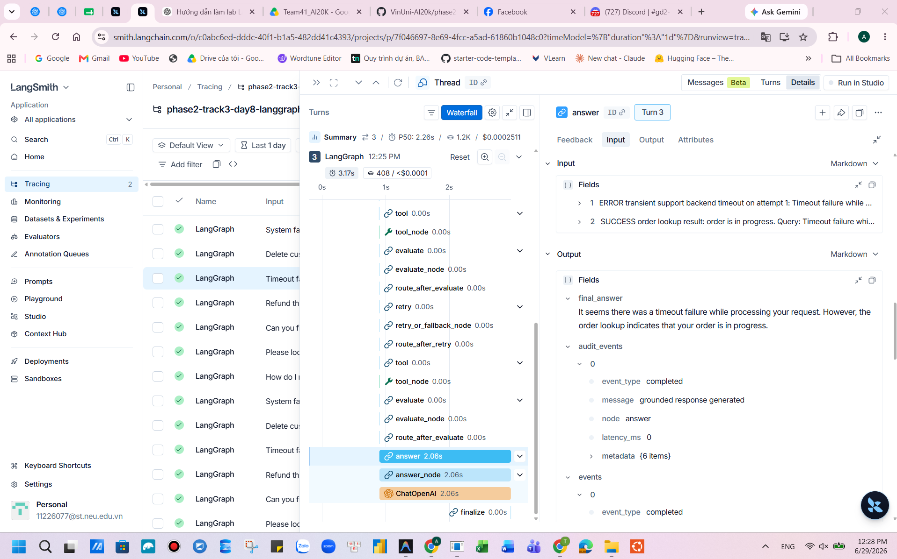
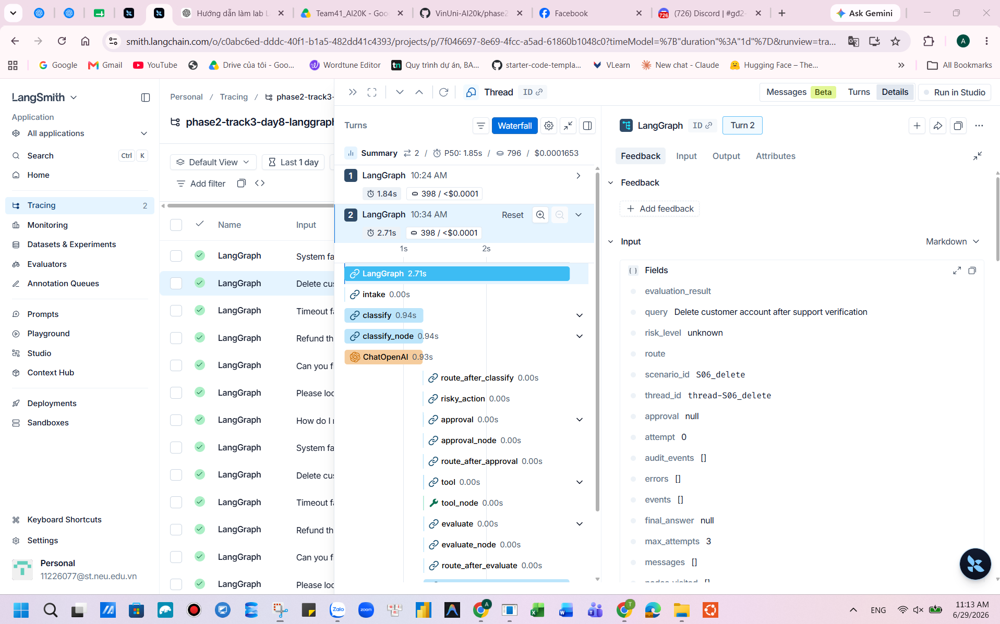
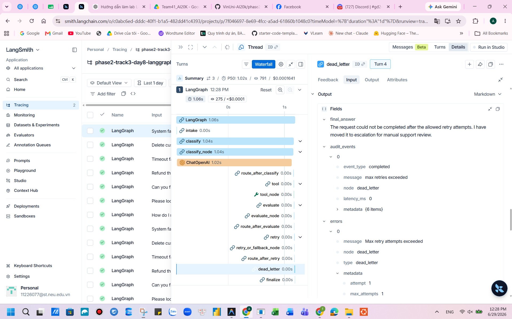

# Day 08 LangGraph Agent Lab Report

## 1. Architecture

The workflow is a LangGraph `StateGraph` for support-ticket orchestration:
`START -> intake -> classify`, then conditional routing to `answer`, `tool`, `clarify`,
or `risky_action`. Runtime errors are not classifier routes. Tool paths run
`tool -> evaluate`; failed evaluations loop through `retry` until
`attempt >= max_attempts`, then move to `dead_letter`. Risky requests must pass through
`risky_action -> approval` before any tool execution. Every terminal path passes through
`finalize -> END`.

## 2. State Schema

| Field | Reducer | Purpose |
|---|---|---|
| query, route, risk_level | overwrite | Current ticket and routing decision |
| attempt, max_attempts | overwrite | Bounded retry control |
| evaluation_result | overwrite | Gate after tool evaluation |
| pending_question | overwrite | Clarification path output |
| proposed_action, approval | overwrite | Human-in-the-loop state for risky actions |
| final_answer | overwrite | Final user-facing response |
| messages | append | Compact execution notes |
| tool_results | append | Tool outputs across retries |
| errors | append | Typed error records |
| events, audit_events | append | Audit trail for grading/debugging |
| nodes_visited | append | Node-level trace for metrics |

## 3. Test Cases

The sample scenario set covers simple answers, lookup/tool usage, missing information,
risky refund/delete actions, runtime tool failures, and dead-letter retry exhaustion.
Hidden scenarios should still work because classification is LLM structured output rather
than scenario-id matching.

## 4. Metrics

| Metric | Value |
|---|---:|
| Total scenarios | 7 |
| Success rate | 100.00% |
| Average nodes visited | 7.00 |
| Average latency ms | 0.00 |
| Total retries | 3 |
| Total interrupts/approvals | 2 |
| Approval observations | 2 |
| Approval rate | 100.00% |

| Scenario | Expected route | Actual route | Success | Retries | Interrupts | Approval action |
|---|---|---|---:|---:|---:|---|
| S01_simple | simple | simple | yes | 0 | 0 |  |
| S02_tool | tool | tool | yes | 0 | 0 |  |
| S03_missing | missing_info | missing_info | yes | 0 | 0 |  |
| S04_risky | risky | risky | yes | 0 | 1 | approve |
| S05_error | tool | tool | yes | 2 | 0 |  |
| S06_delete | risky | risky | yes | 0 | 1 | approve |
| S07_dead_letter | tool | tool | yes | 1 | 0 |  |

## 5. Failure Analysis

1. Retry or tool failure: transient tool outputs include `ERROR`, so `evaluate` returns
`needs_retry`. The graph increments `attempt`, retries while below `max_attempts`, and sends
unresolved failures to `dead_letter` with a typed error.

2. Risky action without approval: side-effecting routes never go directly to `tool`.
They first create `proposed_action`, record an approval decision, and only approved or edited
actions proceed. Rejected actions route to clarification.

## 6. Persistence / Recovery Evidence

The CLI passes a stable `thread_id` per scenario. The default checkpointer is in-memory for
fast local tests, and the `sqlite` backend can persist checkpoints to
`outputs/langgraph_checkpoints.sqlite` when `checkpointer: sqlite` is selected.

## 7. LangSmith Tracing

| Item | Value |
|---|---|
| LangSmith project | phase2-track3-day8-langgraph-lab |
| Tags | `day8`, `langgraph`, `lab` |
| Run metadata | `scenario_id`, `lab=phase2-track3-day8` |

Tracing is added as extra observability and does not replace `metrics.json` or this report.
The traced nodes are `classify_node`, `tool_node`, `evaluate_node`, `answer_node`,
`approval_node`, and `retry_or_fallback_node`. Audit events also include safe metadata such
as `scenario_id`, `route`, `attempt`, `evaluation_result`, and approval decision fields.

LangSmith traces help debug the full path of each scenario: why a ticket was classified into
a route, whether tool outputs produced retry decisions, how many retry attempts happened, and
whether risky requests were approved, rejected, or edited before tool execution.

### LangSmith Evidence

The screenshots are stored in `reports/langsmith_trace/`.

## 8. Improvement Plan

With more production time, I would add a real approval UI for interrupt/resume, richer tool
contracts, latency timing around each node, regression tests for hidden route phrasing, and
state-history replay examples for crash recovery.
